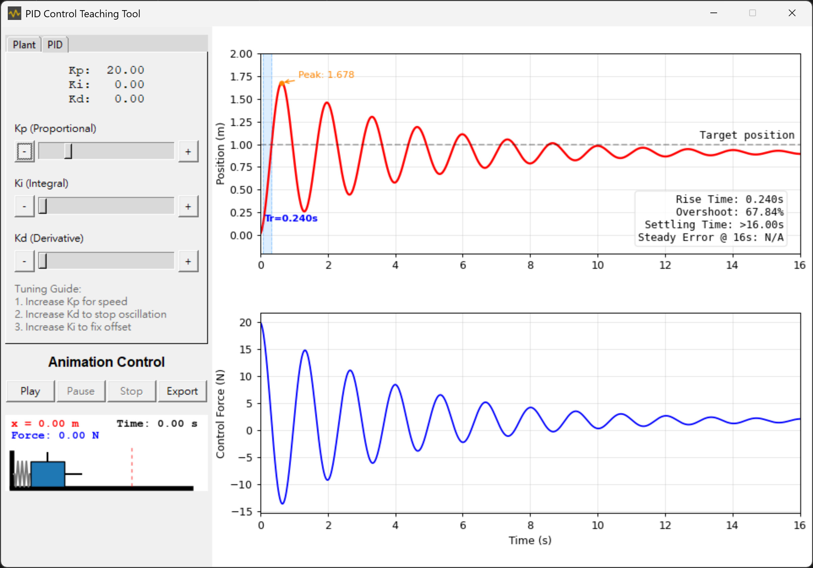

# PID Teaching Aid
A Python-based PID teaching aid: tune Kp / Ki / Kd on a mass-spring-damper
plant and watch the step response, control force, performance metrics
(rise time, overshoot, settling time, steady-state error) and a spring-mass
animation update live. The animation can be exported as a GIF.



## Requirements

- Python 3.10+
- `pip install -r requirements.txt` (numpy, matplotlib, Pillow)

## Run

```
py -3 PIDTeachingAid_GUI.py
```

## Project layout

| File | Purpose |
| --- | --- |
| `PIDTeachingAid_GUI.py` | Main window and application state |
| `simulation.py` | Pure computation: PID simulation and metrics (no GUI) |
| `plotPanel.py` | Response / control-force charts |
| `animPanel.py` | Spring-mass animation and the GIF exporter |
| `boxBase.py` | Reusable widgets (SliderBox, ToolTip) |
| `functions.py` | Small helpers (fonts, resource paths) |
| `tests/` | Automated tests for the computation layer |
| `legacy/` | The original Python 2 versions, kept for reference |

## Test

```
py -3 -m unittest discover tests
```

## Pack the exe

PyInstaller is required. Run `make.bat`, or:

```
py -3 -m PyInstaller PID.spec
```
